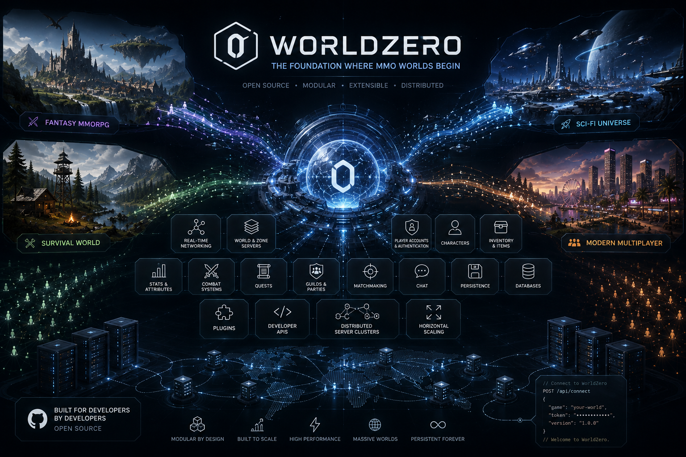

# WorldZero

**Status:** early implementation. `auth`, `character`, `world`, `gateway`, `content`, `chat`, `plugin-host`, and `realm-directory` all have real, tested logic, and `server` is a runnable combined process; `transfer` is still an empty stub. `server` also exposes real `/healthz`/`/readyz` HTTP endpoints (`WZ_HEALTH_ADDR`, default `127.0.0.1:9091`) for wiring up Kubernetes/Agones liveness/readiness probes — see [`docs/specs/Observability_Spec.md`](docs/specs/Observability_Spec.md#health--readiness-endpoints-181). See [`docs/PROPOSAL.md`](docs/PROPOSAL.md) for the full design and [`docs/product/Getting_Started_Developers.md`](docs/product/Getting_Started_Developers.md) to run it yourself.

Building an MMO used to require a small studio's worth of backend engineering before a single player ever saw the game: authentication, character persistence, world simulation, netcode, sharding, chat, matchmaking — all before "is this game fun" could even be tested. WorldZero is an open-source, self-hostable MMO server framework that owns that infrastructure — realms, sharding/layering, world state, netcode, persistence, cross-server character policy — behind a sandboxed plugin system, so a game developer brings their own game logic instead of building a backend from scratch.

## Why WorldZero

The bar isn't "a skilled team could use this" — a few existing projects already clear that bar. The bar is a developer's gut reaction in the first few minutes: *"thank goodness I don't have to build this part, I just need to do XYZ,"* not *"I could just do this myself."* That second reaction is the real thing WorldZero is competing against, more than any specific missing feature elsewhere. See [The Developer Experience Bar](docs/PROPOSAL.md#the-developer-experience-bar) for what that means concretely, and [Prior Art & Positioning](docs/PROPOSAL.md#prior-art--positioning) for the honest look at what else exists.

MMOs used to show up regularly; now a small team spends years reinventing backend plumbing before they find out if their game is even fun, and most never get that far. WorldZero exists so that stops being the reason the genre has gone quiet — it's a piece of shared infrastructure meant to be built on, argued with, and extended by whoever needs it, not a finished product handed down. If it doesn't fit your game yet, that's a gap to close together, not a wall. See [About](docs/product/About.md) for the fuller version of why this project exists.

**WorldZero is:** OSS (Apache-2.0), self-hostable, MMO-genre-specific (realms/shards/layers/character policy as first-class concepts), engine- and client-agnostic, and extensible through a sandboxed WASM plugin system.

**WorldZero is not:** a game engine, a rendering/asset pipeline, an authoring tool, or (at least initially) a hosted SaaS. See [What This Project Is Not](docs/PROPOSAL.md#what-this-project-is-not-non-goals) for the full list.

## Learn more

Full docs live in [`docs/`](docs/README.md); [`docs/PROPOSAL.md`](docs/PROPOSAL.md) is the single source of truth for every design decision. Everything else in `docs/` is a focused extract of one piece of it:

| Product | Architecture & specs | Process |
|---|---|---|
| [About](docs/product/About.md) · [Roadmap](docs/product/Roadmap.md) | [System Architecture](docs/architecture/System_Architecture.md) · [Decisions](https://github.com/LunarVagabond/WorldZero/issues?q=is%3Aissue+label%3Adecision) | [Contributing](.github/CONTRIBUTING.md) |
| [Getting Started (using WorldZero)](docs/product/Getting_Started_Developers.md) | [Specs](docs/specs) — auth, realm/character policy, content manifest, networking, plugin API, data model, observability | [Getting Started (contributing)](docs/developers/Getting_Started.md) |

## Contributing

WorldZero is community-driven from day one — design feedback, documentation, and early implementation work all move it forward before there's even a first release. See [`.github/CONTRIBUTING.md`](.github/CONTRIBUTING.md) for the workflow, or open an issue to discuss an idea first. Plugin authors should also read the [Plugin API](docs/specs/Plugin_API.md) once it's filled in.

## License

Apache-2.0 — see [LICENSE](LICENSE).
